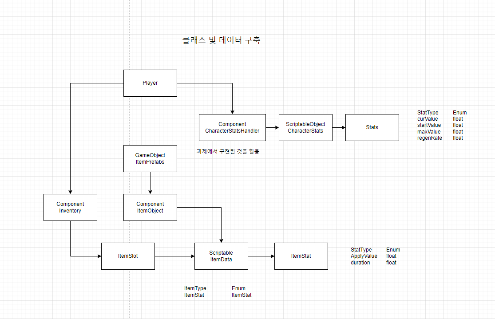

# 3번째 개인 프로젝트

# 개요

 이번 프로젝트에서는 기존 제출된 프로젝트 + 강의의 내용을 포함한 프로젝트에 과제를 진행하여 기존 코드를 활용해 새로운 코드를 작성하고 적용해보는 것을 목표로 진행하였습니다.

 이를 통해서 기존 코드들의 재 사용, 수정을 통해 현 프로젝트에 맞게 개선하는 과정을 거치면서 앞으로의 이전의 코드, 다른 사람의 코드 등 여러 코드들에 맞게 적응할 수 있는 능력을 기르고 싶었습니다.

# 구조설계

## 과제 2의 세부사항

[Chapter 3-2 Unity 게임개발 숙련 개인과제](https://www.notion.so/Chapter-3-2-Unity-3db6735ddda14d6dad34be754e6b0d3f?pvs=21)

## 클래스 설계(계략적)

## 기능 명세서

[기능/구현 목록](3%E1%84%87%E1%85%A5%E1%86%AB%E1%84%8D%E1%85%A2%20%E1%84%80%E1%85%A2%E1%84%8B%E1%85%B5%E1%86%AB%20%E1%84%91%E1%85%B3%E1%84%85%E1%85%A9%E1%84%8C%E1%85%A6%E1%86%A8%E1%84%90%E1%85%B3%20d654c18250b5486fb05265050b3da12f/%E1%84%80%E1%85%B5%E1%84%82%E1%85%B3%E1%86%BC%20%E1%84%80%E1%85%AE%E1%84%92%E1%85%A7%E1%86%AB%20%E1%84%86%E1%85%A9%E1%86%A8%E1%84%85%E1%85%A9%E1%86%A8%20313c5725d92c4bf681d63993a5e322b3.csv)

